<!-- Theme-switching Banner (Toggles dark/light automatically) -->
<picture>
  <source media="(prefers-color-scheme: dark)" srcset="banner.svg">
  <source media="(prefers-color-scheme: light)" srcset="banner-light.svg">
  
</picture>

 

<!-- Grid layout for Lanyard and Stats Cards -->
<table border="0" cellpadding="0" cellspacing="0">
  <tr>
    <!-- Lanyard (Left Column) -->
    <td valign="top" width="360">
      
    </td>
    <!-- Stats Stack (Right Column) -->
    <td valign="top" width="560" style="padding-left: 20px;">
      
        
      
        
      
    </td>
  </tr>
</table>

 

<!-- Interactive Social Buttons (Replace links with your actual URLs) -->

  
  
  
  

