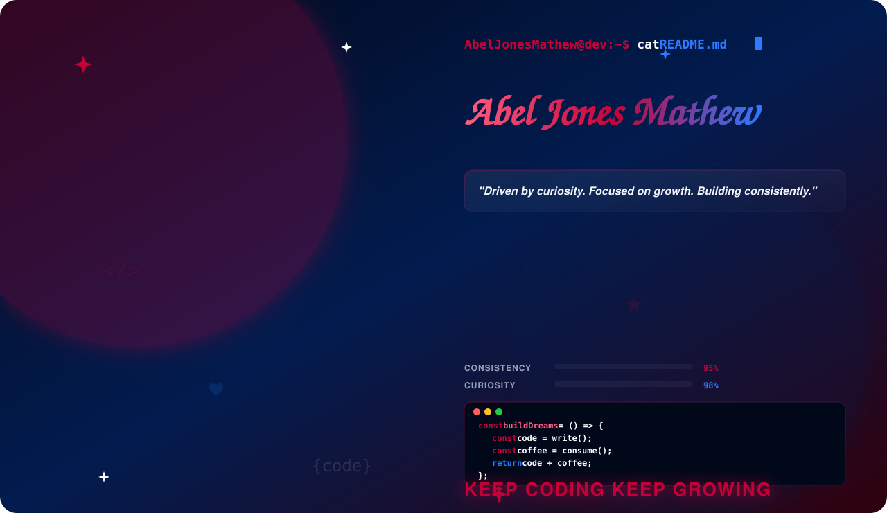
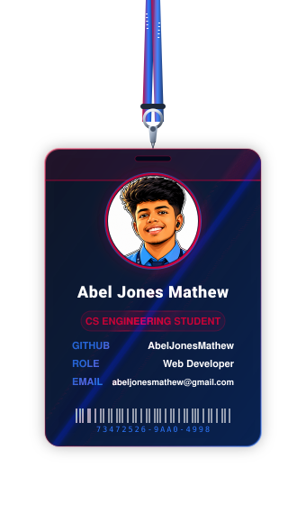
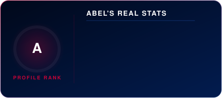

  

<table border="0" width="100%">
  <tr>
    <td width="48%" align="center" valign="middle">
      
    </td>
    <td width="52%" align="center" valign="middle">
      
       
      
       
      
    </td>
  </tr>
</table>

 

  
  
  
  

